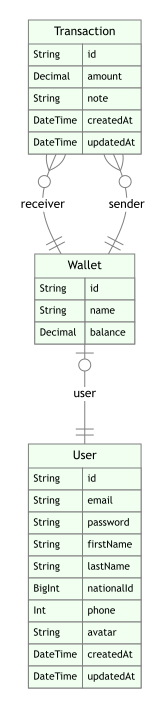

# My Wallet

This is the backend code for **My Wallet** project which is a wallet management app built with **NestJs**.

## Preview

[Front-End](https://my-wallet-client-umber.vercel.app/)

### Note

> You can try the app by creating a new account
> or using on of the below accounts

1. Email: user1@email.com Password: 123456
2. Email: user2@email.com Password: 123456

## Features

- Authentication
- Users Can create wallet
- Users can transfer money from one wallet to another user’s wallet
- Users can see their received and sent transactions separately

## Requirements

- node
- yarn (you can use npm instead)
- docker and docker-compose (optional)

## Setup

### Installation

```bash
$ yarn
```

### Running the app

```bash
# Add your environment variables to .env file like .env.example

# Database
# if you have docker-compose
$ yarn db:up
# or add database link to .env file as DATABASE_URL
$ npx prisma migrate deploy
# Development mode
$ yarn start:dev
```

You can find docs at [http://localhost:3000/docs](http://localhost:3000/docs)

## Technologies

Project is built with **Nestjs** and:

- Nestjs
- Prisma
- JWT
- SendGrid
- Swagger


